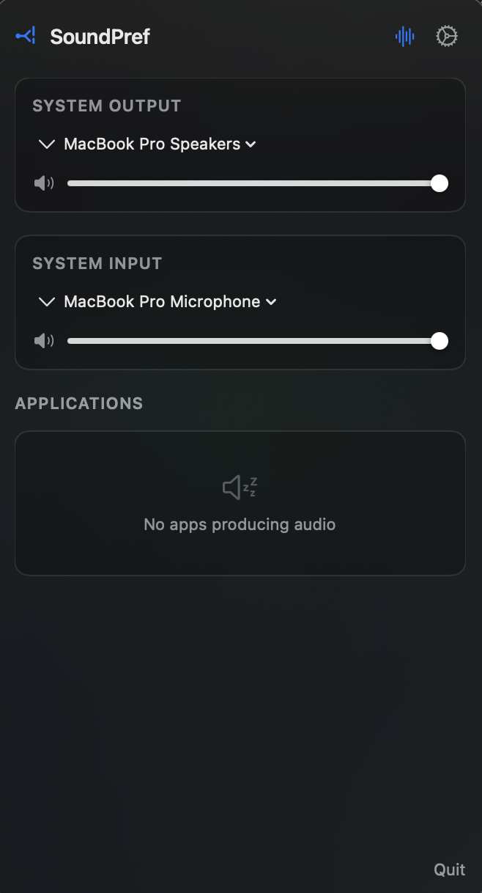
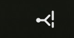

# SoundPref

**A free, open-source macOS audio control utility.**

SoundPref gives you fine-grained control over your Mac's audio: per-application volume, per-application output routing, and quick access to system audio device settings — all from the menu bar.

It's a free alternative to [SoundSource](https://rogueamoeba.com/soundsource/), built entirely on Apple's public Core Audio APIs (no kernel extension, no paid audio backend).


<p align="center">
  
  &nbsp;&nbsp;
  
</p>

## Features (MVP)

- **Per-app volume control** — set independent volume (0–200%) for each running app
- **Per-app mute** — silence individual apps without affecting others
- **Per-app output routing** — route any app to any output device (headphones, speakers, USB DAC, HDMI)
- **System device control** — quick output/input device switching from the menu bar
- **Favorites** — pin apps to always appear in the panel
- **Settings persistence** — volume, mute, and routing settings survive app restarts

## Requirements

- **macOS 14.4** (Sonoma) or later
- **Apple Silicon** or Intel Mac
- **Xcode 15+** for building from source

## How It Works

SoundPref uses Apple's Core Audio process tap API (`AudioHardwareCreateProcessTap`), introduced in macOS 14.4. This API allows apps to capture and control audio from other processes without a kernel extension.

When you adjust an app's volume or route it to a different output:
1. A **process tap** captures the app's audio stream
2. The audio is processed through a **gain node** for volume control
3. The processed audio is routed to your **chosen output device**
4. The original audio on the default device is **muted** (for routing) to prevent double-playback

## Building & Running

Because the app requires specific permissions (Core Audio process tap) that need a properly signed `.app` bundle, simply using `swift run` often fails with macOS Sandbox errors.

Instead, use the included build script to compile, sign, and launch the app automatically:

```bash
./run_app.sh
```

## Making a DMG for Distribution

If you want to package the app into a `.dmg` file to share with others, use the provided DMG script:

```bash
./build_dmg.sh
```

This will create a `SoundPref.dmg` file in your project directory. 

### How to Install
1. Double-click `SoundPref.dmg` to open it.
2. Drag and drop the `SoundPref.app` icon into the `Applications` folder shortcut.
3. Open `Applications` and launch `SoundPref`.

## Privacy

- **All audio processing is 100% local** — nothing is recorded or sent anywhere
- **The purple dot** in the menu bar is Apple's system indicator showing that an app is accessing system audio. This is normal and expected.
- No telemetry, no analytics, no network calls

## License

GPL-3.0 — see [LICENSE](LICENSE) for details.

## Acknowledgments

- Apple's [Core Audio process tap documentation](https://developer.apple.com/documentation/coreaudio/capturing-system-audio-with-core-audio-taps)
- [AudioCap](https://github.com/insidegui/AudioCap) by Guilherme Rambo — reference implementation
- [BlackHole](https://github.com/existentialaudio/blackhole) — inspiration for open-source macOS audio tools
- [SoundSource](https://rogueamoeba.com/soundsource/) by Rogue Amoeba — the app that showed what's possible
